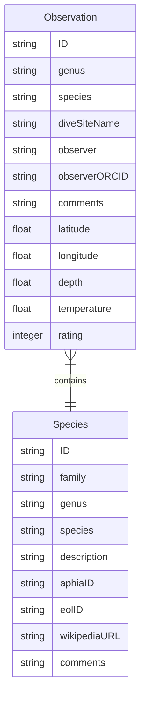

# Data model

To keep the data model simple metadata will only be produce per species and per photo. Family and genus pages can be derived from the species metadata.

## Data format

Species and observation data is stored as Markdown [front matter](https://gitpress.io/c/helps/front-matter) in [YAML format](https://yaml.org/) in [`_species`](_species) and [`_observations`](_observations), respectively.

## IDs

Species ID and Observation ID form the filenames of the appropriate files.

For a species, the ID will take the form of `genus-species` such as `chromodoris-westraliensis`.

For an observation, the ID will take the form of `genus-species-number` such as `chromodoris-westraliensis-0001`

Each Observation must have corresponding photo with an identical filename (exlucding file type suffix). For example, Observation `_observations/chromodoris-westraliensis-0001.md` would have a matching `assets/images/chromodoris-westraliensis-0001/md`.