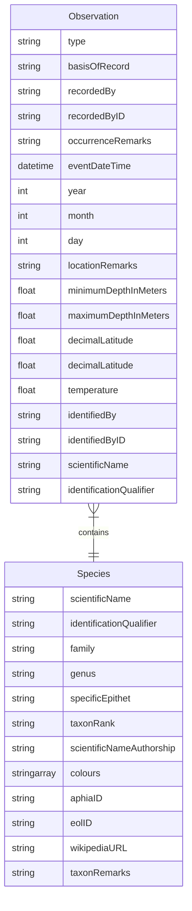

# Data model

To keep the data model simple metadata will only be produce per species and per photo. Family and genus pages can be derived from the species metadata. Where possible, terms are taken from [Darwin Core Simple](https://dwc.tdwg.org/simple/).

## Data format

Species and observation data is stored as Markdown [front matter](https://gitpress.io/c/helps/front-matter) in [YAML format](https://yaml.org/) in [`_species`](_species) and [`_observations`](_observations), respectively.

## IDs

Species ID and Observation ID form the filenames of the appropriate files.

For a species, the ID will take the form of `scientificName` such as `chromodoris-westraliensis` or `scientificName-identificationQualifier` such as `aphelodoris-sp.-1` if the species has not yet been described..

For an observation, the ID will take the form of `scientificName-number` such as `chromodoris-westraliensis-0001` or `scientificName-identificationQualifier-number` if a species-level identification cannot be made.

Each Observation must have corresponding photo with an identical filename (excluding file type suffix). For example, Observation `_observations/chromodoris-westraliensis-0001.md` would have a matching `assets/images/chromodoris-westraliensis-0001.jpg`.