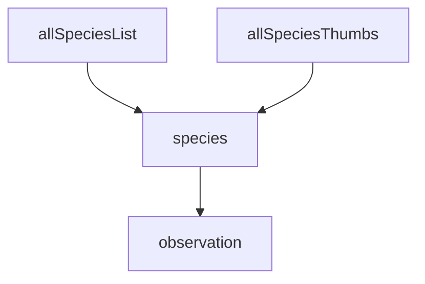

# Site layout

## allSpeciesList

One only: an indented bulleted list portraying the taxonomy hierarchy of all observations.

## allSpeciesThumbs

One only: the highest-rated thumbnail for each species.

## familySpeciesThumbs

One per family: the highest-rated thumbnail for each species of that family.

## genusSpeciesThumbs

One per genus: the highest-rated thumbnail for each species of that genus.

## species

One per species: Detailed information of that species.

## observation

One per observation: Detailed information of that observation.